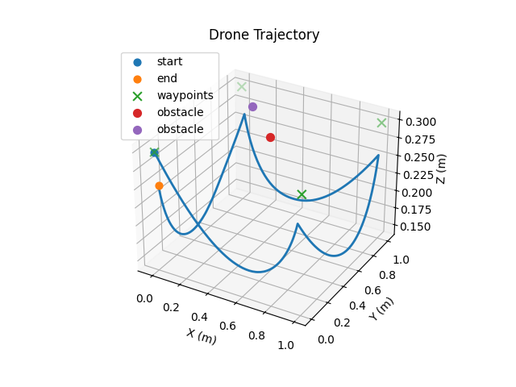

# PyBullet Path Follower

A tiny "drone" (sphere) that follows 3D waypoints at constant speed with optional obstacle repulsion, CSV logging, and MP4 recording.

## Table of Contents

- [Demo Media](#demo-media)
- [Features](#features)
- [Quickstart (Windows)](#quickstart-windows)
- [Run Commands](#run-commands)
- [CLI Flags](#cli-flags)
- [Waypoints & Obstacles](#waypoints--obstacles)
- [How It Works](#how-it-works)
- [Troubleshooting](#troubleshooting)
- [What I Learned](#what-i-learned)
- [License](#license)

## Demo Media



*3D trajectory visualization showing drone path through waypoints*

**Video Demo**: See `assets/demo.mp4` for a recorded simulation

## Features

• **Plane + Sphere Drone**: Simple physics simulation with ground plane and spherical robot  
• **3-5 Waypoints**: Configurable JSON waypoint sequences for path following  
• **Constant-Speed Controller**: Maintains steady velocity between waypoints  
• **Arrival Threshold**: Customizable `--eps` distance for waypoint switching  
• **Console Logging**: Real-time position and progress updates  
• **Optional Obstacles**: Spherical obstacles with repulsion-based avoidance  
• **CSV Trajectory**: Complete position/time data logging for analysis  
• **MP4 Recording**: Headless video capture with TinyRenderer  
• **3D Plot**: Matplotlib-based trajectory visualization and PNG export  

## Quickstart (Windows)

If you already have a `.venv` folder in the repo root:

```powershell
.\.venv\Scripts\Activate.ps1
pip install -r requirements.txt
```

### From Scratch

If you need to create a virtual environment:

```powershell
python -m venv .venv
.\.venv\Scripts\Activate.ps1
pip install -r requirements.txt
```

**Note for macOS/Linux**: Use `python3` and `source .venv/bin/activate` instead.

## Run Commands

All commands assume you're in the repo root with the virtual environment activated.

### GUI Mode

```powershell
python main.py --gui
```

### Headless Video Recording (TinyRenderer)

```powershell
python main.py --record --video assets/demo.mp4 --dt 0.02
```

### Plot Trajectory (and Save PNG)

```powershell
python traj_plot.py
```

## CLI Flags

### main.py Options

| Flag | Default | Description |
|------|---------|-------------|
| `--gui` | False | Show PyBullet GUI (default is headless) |
| `--speed` | 0.6 | Constant drone speed in m/s |
| `--dt` | 1/240 | Physics timestep in seconds |
| `--eps` | 0.05 | Arrival threshold distance in meters |
| `--max-steps` | 12000 | Safety limit for simulation steps |
| `--waypoints` | waypoints.json | Path to waypoints configuration file |
| `--obstacles` | obstacles.json | Path to obstacles configuration file |
| `--traj-out` | trajectory.csv | Output file for trajectory data |
| `--record` | False | Enable video recording |
| `--video` | assets/demo.mp4 | Output video file path |

**Tips:**
- Lower `--dt` (e.g., 0.01) for smoother videos but larger files
- Increase `--eps` for faster waypoint switching
- Use `--speed` between 0.2-2.0 for realistic movement

## Waypoints & Obstacles

### Waypoints (`waypoints.json`)

Example waypoint sequence:

```json
[[1.0, 0.0, 0.3], [1.0, 1.0, 0.3], [0.0, 1.0, 0.3], [0.0, 0.0, 0.3]]
```

Each waypoint is `[x, y, z]` coordinates in meters.

### Obstacles (`obstacles.json`)

Example spherical obstacles:

```json
[
  {"center": [0.5, 0.5, 0.3], "radius": 0.20},
  {"center": [0.2, 0.8, 0.3], "radius": 0.15}
]
```

**Note**: Obstacles are spherical with center position `[x, y, z]` and radius in meters. The drone will automatically avoid them using a repulsion field.

## How It Works

**Beginner Explanation:**

1. **Read State**: Get current drone position from PyBullet physics
2. **Direction to Waypoint**: Calculate vector pointing toward next target
3. **Constant-Speed Velocity**: Normalize direction and multiply by desired speed
4. **Switch When Within Eps**: Move to next waypoint when close enough to current one
5. **Optional Repulsion**: Add obstacle avoidance force if obstacles are present
6. **Step Simulation**: Apply velocity and advance physics by one timestep
7. **Log & Record**: Save position data and optionally capture video frame

This creates smooth, predictable motion that's easy to visualize and analyze.

## Troubleshooting

### PyBullet GUI doesn't open
- Run locally (not on remote desktop/SSH)
- Install PyOpenGL: `pip install PyOpenGL PyOpenGL-accelerate`
- Use `--record` mode instead for headless operation

### MP4 writing error
```powershell
pip install imageio-ffmpeg
```

### Video slow/large file size
- Increase `--dt` to skip frames (e.g., `--dt 0.05`)
- Reduce simulation duration with `--max-steps`
- Consider lower quality encoding

### OneDrive file lock issues
- Close applications that might access the files
- Pause OneDrive sync temporarily
- Move project folder outside OneDrive directory

## What I Learned

• **Simulation Loop Design**: Managing real-time physics stepping while maintaining consistent data logging and optional video recording  
• **Velocity-Based Control**: Using direct velocity commands instead of force-based control for predictable, constant-speed movement  
• **Reproducible Artifacts**: Creating systematic outputs (CSV logs, videos, plots) that enable analysis and debugging of autonomous behavior  

## License

MIT

---

*This project demonstrates basic autonomous navigation concepts using PyBullet's physics simulation environment.*